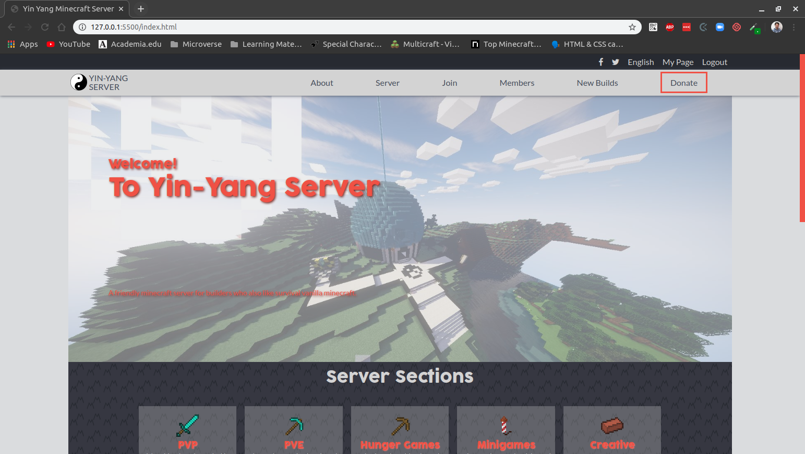
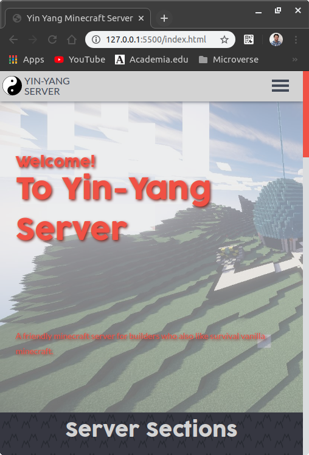

# Conference Page

> The purpose of this project is to demonstrate my mastery of the HTML and CSS concepts learned along the first seven projects.

## Built With

- HTML
- CSS
- SASS

## Live Demo

[Live Demo Link](https://raw.githack.com/MiguelDP4/capstone-html-css/developing/index.html)

## Project Showcase

[Project showcase on youtube](https://www.youtube.com/watch?v=ayUNlcpEHYw)

## Getting Started

The project is ready to deploy, you can just upload it to your host server and have it in your domain.

## Authors

👤 **Miguel Dubois (Mike)**

- Github: [@MiguelDP4](https://github.com/MiguelDP4)
- Twitter [@Mike_DP4](https://twitter.com/Mike_DP4)

## 🤝 Contributing

This project is for educational purposes only, suggestions are accepted, but no contributions.

## Show your support

Give a ⭐️ if you like this project!

## 📝 License

This project is [Creative Commons](https://creativecommons.org/licenses/by-nc/4.0/) licensed.

Author of the template I followed is [Cindy Shin](https://www.behance.net/adagio07) and the template can be found [here](https://www.behance.net/gallery/29845175/CC-Global-Summit-2015).
